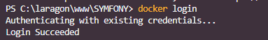
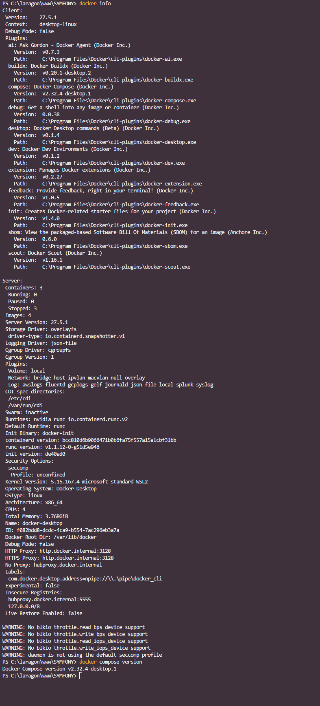

### welcome-to-symfony

Premiers pas avec Symfony.  
----------------------------------

## Ouvrir Docker et Docker compose ##  

Commande : docker login   [Ouvrir Docker]
=> pour se connecter à Docker  

  

  

Généralement, sous Windows et IOS, Docker compose est installé en même temps que Docker. Pour le vérifier dans le Terminal, il faut taper :   

comCommande : docker compose version [si on obtient une réponse, avec une version, c'est que Compose est présent]  

  

Installation de scoop pour installer Symfony plus facilement.

Installation de Symfony version 7.2.3 depuis le Terminal de VSCode

Installation de Docker-compose 

